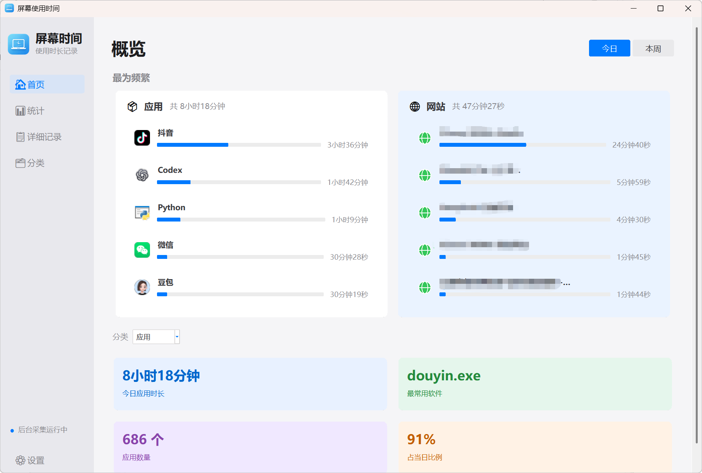
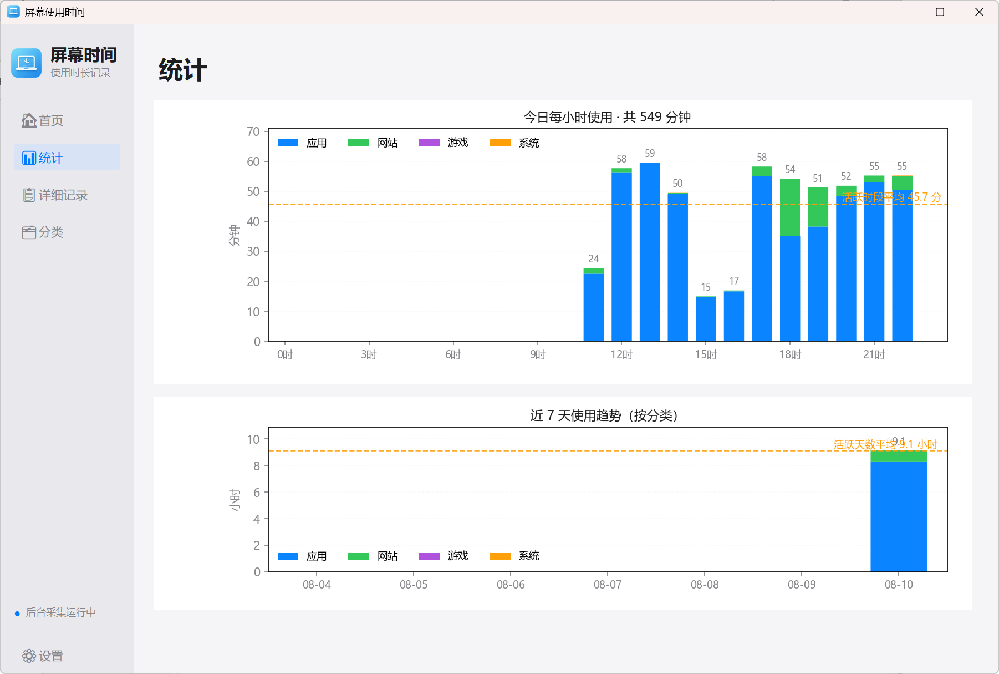
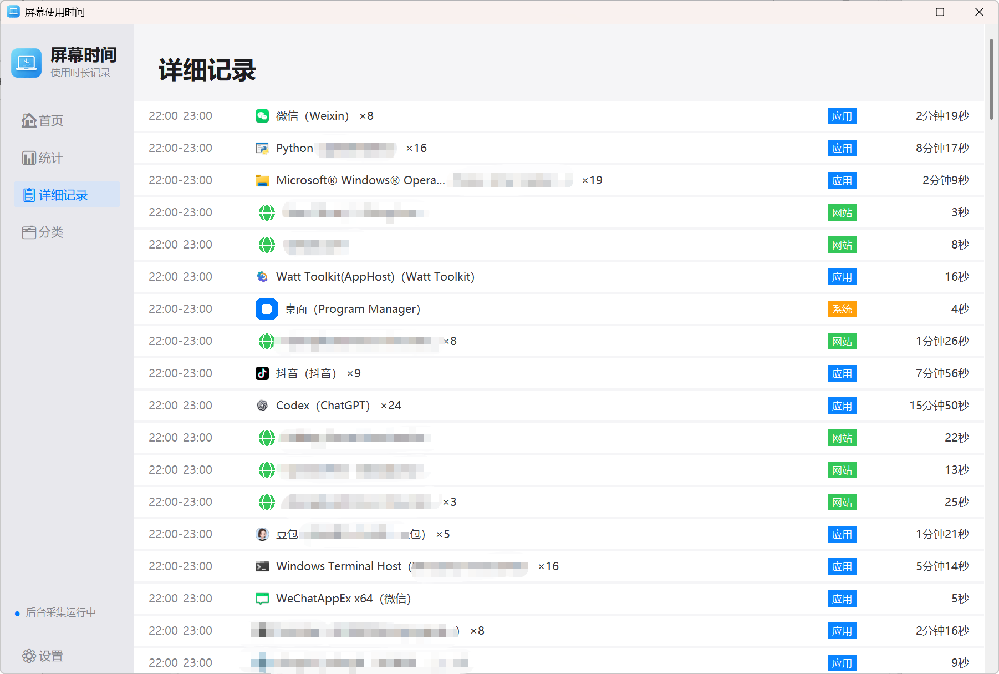
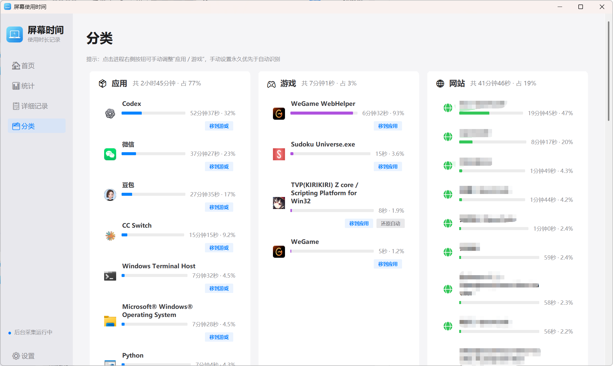
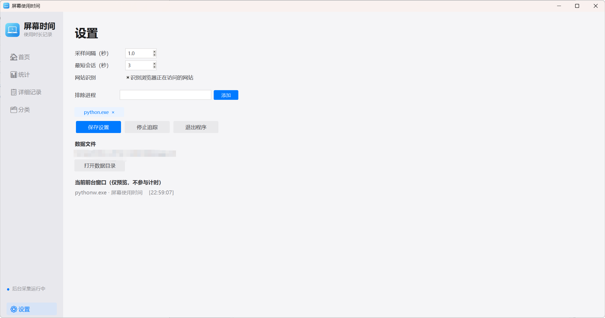

# 屏幕使用时间统计工具

一个用 Python 编写的 Windows 桌面工具：自动检测当前聚焦的前台窗口/进程，记录使用时长，并用浅色风格的界面可视化展示。

界面参考 蓝强调色、圆角卡片与控件、左侧导航栏，整体轻量扁平。

## 功能特性

- **前台窗口采集**：通过 Win32 API 采样当前前台窗口（仅用标准库 `ctypes`），识别桌面软件、游戏、浏览器、桌面/锁屏并自动分类
- **游戏识别规则引擎**：不靠逐个加游戏名，按“启动器/安装目录”关键字（Steam / Riot / Epic / 战网 / WeGame / 米哈游 等）+ 进程名规则自动识别，Unreal 引擎客户端（`-Win64-Shipping.exe`）自动兜底，规则可在 `game_rules.json` 里增删
- **具体网站识别**：浏览器窗口标题 + 浏览器历史库（SQLite）匹配出当前正在看的网站，支持 Chrome / Edge / Firefox；全程本地匹配，不联网、不上传任何数据
- **网站自动去重**：多标签窗口标题里的“和另外 N 个页面”等后缀会被清洗，同一网站自动合并统计
- **会话记录**：按“进程 / 网站”累计时长，存入 SQLite（`data/usage.db`，WAL 模式，支持 GUI 读 + 后台写并发）
- **浅色 GUI**：首页（概览）、统计、详细记录、分类、设置五个页面，左侧导航栏 + 右侧内容区
- **统计图表**：今日每小时使用柱状图、近 7 天分类趋势图（圆角柱、平均线），随窗口大小自适应缩放
- **详细记录按小时合并**：同一小时内同一进程/网站合并为一行，显示时间区间 `XX:00-(XX+1):00` 与总时长、出现次数
- **分类页全量展示**：应用 / 游戏 / 网站三张卡片，显示该分类全部进程/网站，每项带时长与占分类总时长百分比，名称完整显示（自动换行）
- **手动分类覆盖**：分类页每个进程行带「移到游戏 / 移到应用」按钮，点击即把该进程永久归到目标分类，写入 `category_overrides.json` 立即生效；「还原自动」一键清除并恢复规则引擎判定
- **系统托盘常驻**：最小化到托盘继续记录，托盘菜单可恢复主界面 / 退出
- **互斥采集**：`dashboard` 与 `start` 共用同一把锁，保证同时只有一个采集进程写库，避免时长重复统计
- **实时刷新**：每 2 秒刷新首页、分类、设置页数据

## 页面展示










## 运行要求

- Windows 10 / 11（依赖 Win32 API，不支持 macOS / Linux）
- Python 3.10+（代码使用了 `str | None` 等新语法）
- 依赖：
  - `matplotlib>=3.5`（图表，见 `requirements.txt`）
  - Pillow（图标与 Logo 显示；缺失时图标回退为默认占位）

## 快速开始

```bash
cd focus-time-tracker
python -m pip install -r requirements.txt
python -m pip install pillow        # 建议安装，用于图标 / Logo

python main.py dashboard            # 打开可视化界面（自动在后台开始采集）
python main.py start                # 仅后台采集，不开界面（Ctrl+C 停止）
python main.py stats                # 控制台查看今日统计
python main.py report               # 生成今日报告图片
python main.py report --days 7      # 生成近 7 天趋势图
```

> 注意：`dashboard` 会自动拉起独立后台采集进程，`start` 也会启动采集，两者互斥，**不要同时运行**，否则会重复统计。

想先看看效果？执行 `python main.py demo` 生成 7 天示例数据（会混入现有数据，介意的话先备份 `data/usage.db`），再打开界面或执行 `python main.py report --days 7`。

## 命令一览

| 命令 | 说明 |
| --- | --- |
| `python main.py dashboard` | 打开可视化界面（自动开始后台采集） |
| `python main.py start` | 后台采集（前台循环，Ctrl+C 停止） |
| `python main.py stats` | 控制台打印今日统计 |
| `python main.py report` | 生成今日报告 PNG |
| `python main.py report --days N` | 生成近 N 天趋势图 |
| `python main.py now` | 查看当前前台窗口信息（诊断用） |
| `python main.py game rules` | 打印当前生效的游戏识别规则 |
| `python main.py game check --path "C:\Riot Games\VALORANT\live\VALORANT.exe" --process VALORANT.exe` | 按规则判断某个进程/路径是否为游戏 |
| `python main.py unlock` | 清除残留采集锁（提示“已有采集会话在运行”时使用） |
| `python main.py demo` | 生成 7 天示例数据，便于预览 |

## GUI 页面说明

- **首页（概览）**：右上角「今日 / 本周」切换；「最为频繁」区应用 / 网站两张卡片（宽屏并排、窄窗自动竖排），每行 = 图标 + 名称 + 进度条 + 时长；下方分类下拉框与 4 张统计卡
- **统计**：今日每小时使用时长柱状图、近 7 天分类趋势堆叠柱状图；圆角柱、平均线（只统计有使用的时段/天数），随窗口自适应
- **详细记录**：按「小时 + 同一进程/网站」合并展示，时间区间 `XX:00-(XX+1):00`，时长与次数（×N）
- **分类**：应用 / 游戏 / 网站三张卡片（宽屏三栏、窄窗竖排），显示该分类全部进程/网站、时长与占分类总时长百分比，名称完整显示；应用 / 游戏每行带「移到游戏 / 移到应用」按钮（手动设置过则显示「还原自动」），点击后该进程及历史记录立即重分类
- **设置**：采样间隔、最短会话、网站识别开关（三行垂直排布）、排除进程（胶囊标签，点击可单个删除）、保存 / 停止追踪 / 退出、数据目录、当前前台窗口预览

## 配置（config.json）

```json
{
  "poll_interval_seconds": 1.0,
  "min_session_seconds": 3,
  "exclude_processes": ["python.exe"],
  "browser_site_tracking": true,
  "data_dir": "data",
  "report_dir": "reports"
}
```

- `poll_interval_seconds`：采样间隔（秒），调小更精确、调大更省资源
- `min_session_seconds`：短于该时长的窗口切换不记录，避免碎片数据
- `exclude_processes`：不想统计的进程名，如 `["explorer.exe"]`；处于这些进程时不累计任何应用时长
- `browser_site_tracking`：是否识别浏览器正在访问的具体网站；关闭后浏览器按普通应用统计
- `data_dir` / `report_dir`：数据与报告目录（相对项目根目录，也可写绝对路径）

## 游戏识别规则（game_rules.json）

游戏分类按“规则引擎”判断，而不是逐个维护游戏名，新增平台/游戏基本不用改代码：

- **path_keywords**：安装目录关键字，命中即算游戏。默认已含 `steamapps`（Steam）、`riot games`（无畏契约 / 英雄联盟）、`epic games`、`battle.net` / `battlenet` / `blizzard`（战网）、`ubisoft`、`ea games`、`gog galaxy`、`wegame` / `rail_apps`（腾讯 WeGame）、`hoyoplay` / `mihoyo` / `hoyoverse`（米哈游）、`rockstar games`、`2k games`、`netease` 等
- **process_suffix**：进程名后缀特征。默认含 `-win64-shipping.exe` / `-win32-shipping.exe`，这是 Unreal 引擎发行版客户端的统一命名，可自动覆盖三角洲行动等大量 UE 游戏
- **process_exact**：进程名精确匹配（小写、带 `.exe`），仅作兜底，例如 `valorant.exe`、`genshinimpact.exe`
- **exclude_path_keywords** / **exclude_process_exact**：排除规则，防止目录关键字误伤普通软件（默认已排除网易云音乐、有道、微信、QQ）

规则默认**向内置列表追加**并自动去重（例如想加一个自装游戏目录，只需在 `path_keywords` 里补一行）；若想彻底替换内置列表，把 `replace_defaults` 改为 `true`。改完 `game_rules.json` 后重启采集进程生效（历史数据会在下次打开数据库时自动按新规则回填）。判断某个进程当前会被识别成什么，可执行：

```bash
python main.py game check --process VALORANT.exe --path "C:\Riot Games\VALORANT\live\VALORANT.exe"
python main.py game rules
```

> 注意：源码运行时读的是项目根目录的 `game_rules.json`；打包版读的是 exe 同目录的 `game_rules.json`。

## 手动分类覆盖（category_overrides.json）

自动规则偶尔会认错（比如游戏没装在规则覆盖的目录、或普通软件被目录关键字误伤），不用改代码，直接在**分类页**手动调整：

- 应用 / 游戏卡片里每个进程行右侧有「移到游戏 / 移到应用」按钮，点击后该进程**永久**归到目标分类，历史记录也会同步重分类
- 手动设置过覆盖的进程，按钮旁会出现「还原自动」，点击后清除手动设置，恢复规则引擎自动识别（历史记录按规则重新判定）
- 覆盖写在与 exe 同目录的 `category_overrides.json`（源码运行则是项目根目录），格式：`{ "进程名小写": "应用" | "游戏" }`，例如把 `cs2.exe` 手动归为应用就写 `{"cs2.exe": "应用"}`
- 分类优先级：**手动覆盖 > 游戏规则 > 网站 > 应用**；改完**立即生效**，无需重启采集

## 开机自动记录

方式一：把 `启动屏幕时间.vbs` 的快捷方式放进启动文件夹（`Win + R` → `shell:startup`），双击后无控制台窗口，自动后台采集并打开界面。

方式二：在启动文件夹放一个快捷方式，目标填：

```text
C:\...\pythonw.exe C:\...\focus-time-tracker\main.py start
```

## 打包成 exe（无需安装 Python 即可运行）

```bash
python -m pip install pyinstaller
python -m PyInstaller --noconfirm --clean --onedir --windowed `
  --name "屏幕使用时间" --icon assets\logo.ico `
  --add-data "assets;assets" launcher.py
```

- 产物在 `dist\屏幕使用时间\`，把**整个文件夹**拷走即可（onedir 模式下不能只拷 exe）
- 打包后把 `config.json`、`game_rules.json` 也拷到 exe 同目录，自定义配置与游戏规则才会生效（`category_overrides.json` 由分类页写入，自动生成在 exe 同目录）
- 数据目录在 exe 旁边的 `data\`（随文件夹一起移动）；运行时首次启动会自动创建
- 双击 exe 直接打开界面并自动后台采集；点右上角 × 会最小化到系统托盘继续记录
- 想打成单个 exe 文件：把参数 `--onedir` 换成 `--onefile`（启动稍慢、体积更大）

## 数据与隐私

- 数据库：`data/usage.db`（SQLite），报告图片：`reports/` 目录
- `data/`、`reports/` 是运行时生成的数据，已被 `.gitignore` 排除，**不会**被提交到版本库
- 网站识别、时长统计全部在本地完成，不联网、不上传任何数据
- 想清空记录重新开始：退出程序后删除 `data/usage.db`（连同 `-wal` / `-shm` 文件）即可

## 常见问题

- **网站是怎么识别出来的？** 浏览器窗口标题通常就是当前页面标题，程序把标题与浏览器历史库（SQLite）里最近访问的记录做匹配，得到站点域名与完整 URL。隐私模式、历史被清空时会退化为用窗口标题展示。
- **为什么分类里的网站不重复了？** 多标签窗口标题（“X 和另外 N 个页面 - 个人 - Microsoft Edge”）里的噪音会被统一清洗，同一网站自动合并；历史脏数据在打开界面时也会按清洗后的站点名合并。
- **统计图切换页面后只显示左上角？** 已修复：图形尺寸始终按画布实际尺寸校准，切换页面、缩放窗口都不会再错位。
- **识别不准怎么办？** 在「分类」页对应进程行点「移到游戏 / 移到应用」手动调整，永久生效；点「还原自动」恢复规则引擎识别。误伤规则本身可在 `game_rules.json` 里改。
- **`python main.py now` 显示“未获取到前台窗口”**：说明当前运行在非交互桌面/会话里（远程会话、计划任务、服务等）。请在你本人的正常登录桌面终端运行。
- **跨天会话**：跨午夜的长会话会自动按天拆分，归属各自日期。

## 项目结构

```text
focus-time-tracker/
├── main.py                 # 命令行入口
├── config.json             # 配置
├── game_rules.json         # 游戏识别规则（可自行增删）
├── category_overrides.json # 手动分类覆盖（分类页写入，可选）
├── requirements.txt
├── 启动屏幕时间.vbs         # 无控制台窗口启动（后台采集 + 界面）
├── assets/                 # 品牌 Logo（logo.png / logo.ico）
├── tracker/
│   ├── monitor.py          # Win32 前台窗口采集 + 记录主循环
│   ├── games.py            # 游戏识别规则引擎
│   ├── db.py               # SQLite 存储与聚合查询
│   ├── browser.py          # 浏览器当前网站识别（Chrome/Edge/Firefox）
│   ├── report.py           # 命令行报告图表
│   ├── app.py              # GUI（首页/统计/详细记录/分类/设置）
│   ├── widgets.py          # 圆角控件、进程图标与软件名解析
│   ├── theme.py            # 浅色主题（配色/字体/圆角）
│   ├── tray.py             # 系统托盘
│   ├── demo.py             # 示例数据
│   └── utils.py            # 工具函数（时长格式化、站点名清洗）
├── data/                   # 运行时生成（SQLite，已被 .gitignore 排除）
└── reports/                # 运行时生成（PNG 报告，已被 .gitignore 排除）
```
